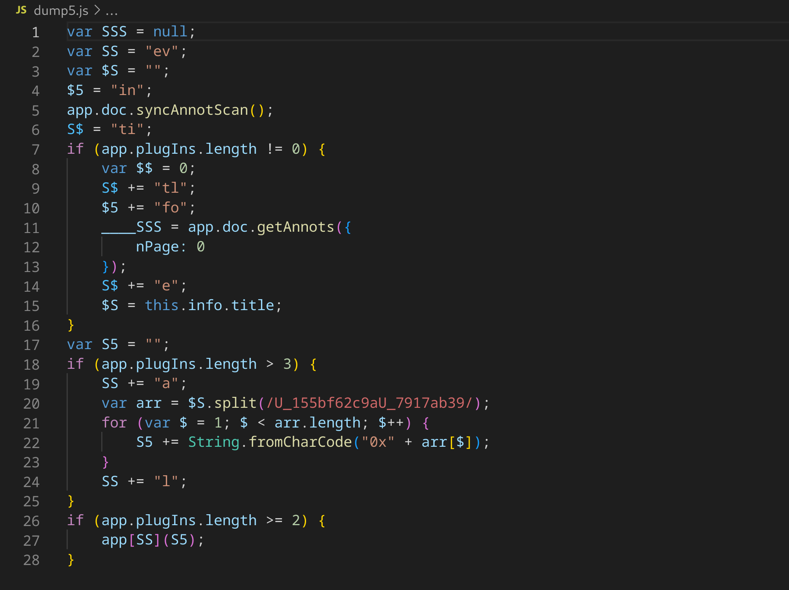

# GetPDF - Malware_Analysis

## Description

PDF format is the de-facto standard in exchanging documents online. Such popularity, however, has also attracted cyber criminals in spreading malware to unsuspecting users. The ability to generate malicious pdf files to distribute malware is a functionality that has been built into many exploit kits. As users are less cautious about opening PDF files, the malicious PDF file has become quite a successful attack vector.
The network traffic is captured in lala.pcap contains network traffic related to a typical malicious PDF file attack, in which an unsuspecting user opens a compromised web page, which redirects the user’s web browser to a URL of a malicious PDF file. As the PDF plug-in of the browser opens the PDF, the unpatched version of Adobe Acrobat Reader is exploited and, as a result, downloads and silently installs malware on the user’s machine.
As a soc analyst, analyze the PDF and answer the questions.

-> challenge: https://download.cyberdefenders.org/BlueYard/c31-Malicious-Portable.zip

## Quick overview

A **Malware** infection happened because of malicious `pdf` file downloaded from compromised website, we're gonna investigate the network traffic and the malicious pdf file to reveal the artifacts of this attack.

## Solution

Q1- How many URL path(s) are involved in this incident?

- We're gonna start by analysing the **pcap file** using wireshark to have a look at the network traffic and find out the **attack vector**.
Here we're interested in the **http** traffic, so we'll use this filter to show the different http requests to the different endpoints: `http && frame contains "GET"`

We can see 6 different endpoints among the http trafic, and very interesting ones, we'll see.
evidences that we need to save are:
Victim's IP: `172.16.201.128`
Compromised website: `202.190.85.44`
First http request at: `2010-10-07 07:58:03`

-> `6`

Q2- What is the URL which contains the JS code?

- Once we discovered the http traffic we're interested in, we'll take closer look, let's pick-up a request and **follow the HTTP stream**, you'll find something like this:

The request is sent to the host **blog.honeynet.org.my** for **/forensic_challenge/** endpoint and we see that the answer contains **obfuscated JavaScript code**.

-> `http://blog.honeynet.org.my/forensic_challenge/`

Q3- What is the URL hidden in the JS code?

- The js code is obfuscated and hard to understand in this state

We don't want to dinamically run this code directly as we don't know its behavior and it could be dangerous, so I cleaned the code a little bit, it became like this

We can see that the purpose of this code is to execute another **malicious js code** after decoding some encoded strings and unhide the stage 2 of the malicious code.
Instead of reversing the code, we can execute it by replacing `eval(result)` with `console.log(result)`

The last script is trying to fetch **getpdf.php** and insert it to that web page by this URL:

-> `http://blog.honeynet.org.my/forensic_challenge/getpdf.php`

Q4- What is the MD5 hash of the PDF file contained in the packet?

- Apparently **getpdf.php** is used to download the pdf file by sending **GET request** to **/fcexploit.pdf**, we can export this pdf file to our local machine in wireshark from **File -> Export Objects** and then select **fcexploit.pdf**

This command allows us to determine the **md5 hash** as it's important to recognize this file on **VirusTotal** for example, `md5sum fcexploit.pdf`

-> `659cf4c6baa87b082227540047538c2a`

Q5- How many object(s) are contained inside the PDF file?

- After exporting the pdf file, we can analyse it using different tools, such as **pdfid** that will give us some informations about it, such as **objects** number.

-> `19`

Q6- How many filtering schemes are used for the object streams?

- Before answering the question, we need to understand what whare are **objects** and **streams**. **Objects** are the fundamental components used to represent the various elements of the pdf file. **Object Streams** are a sequence of instructions to be executed like displaying text ...
Streams are composed of many **keywords**, one of them is **/Filter** which is used to specify the **encoding scheme** used to encode the **stream instructions bytes** so the pdf reader can decode them.
We can see various encoding schemes within the pdf file

-> `4`

Q7- What is the number of the 'object stream' that might contain malicious JS code?

- We can confirm using **pdfid** that there is an **object** within the pdf that contains **javascript** code which is not usual. After this step, **peepdf** tool is very good option to identify **objects ids** and then extract them

-> `5`

Q8- Analyzing the PDF file. What 'object-streams' contain the JS code responsible for executing the shellcodes? The JS code is divided into two streams. Format: two numbers separated with ','. Put the numbers in ascending order

- From the previous question, we found 5 streams within the pdf file, 4 of them are **encoded** which makes them more suspicious, specially after knowing that the object 5 contains Javascript code, and they are **5, 7, 9, 10**, let's dump each stream to see its content using **pdf-parser.py** tool `python2 DidierStevensSuite/pdf-parser.py -o 5 -d dump5 --filter fcexploit.pdf` (`--filter` is specified to decode the streams).

The streams 7, 9, 10 data make no sense, just some numbers and letters, but I noticed that there are repeated expressions and couple numbers changes continuously, which means that maybe there is **hidden script** within it, to confirm that, we're gonna analyse the **stream 5** since it's clear **js code**.

The most important thing here, is that this script is deleting every **U_155bf62c9aU_7917ab39** which is included in **stream 10** and then decoding it from **hex**, which means we're right about our guessing, so we're gonna do this manually, then we get similar script which is trying to replace **X_17844743X_170987743** which is contained in **stream 9** and **89af50d** from **stream 7** with **%**, we can remove the "%" sign and then decode the final data from each script from **decimal ascii values** to **chars** and we can finally find that these two streams 7 and 9 are two parts of a **js script** which is until now the **stage3** of the malware, and for sure they're executing **shellcodes** and **payloads**.

-> `7,9`

Q9- The JS code responsible for executing the exploit contains shellcodes that drop malicious executable files. What is the full path of malicious executable files after being dropped by the malware on the victim machine?

-> Once we uncovered the malicious javascript codes, we can clearly find **4 shellcodes**, we'll copy one of them to a new file called **shellcode.dat** for example, then we'll use **scdbg** (shellcode debugger) which will mainly list all **API functions calls**, and one of them will be the one that drops the malicious executable to the machine, in this case there are two: **URLDownloadToFileA** and **WinExec**

the shellcode is downloading the malware from **blog.honeynet.org.my** to the location **c:\WINDOWS\system32\a.exe** then executing it through the call **WinExec**

-> `c:\WINDOWS\system32\a.exe` 

Q10- The PDF file contains another exploit related to CVE-2010-0188. What is the URL of the malicious executable that the shellcode associated with this exploit drop?

- In this question there is free hint :)) :*Using 'pdf-parser -a fcexploit.pdf' command. You will get that the 11th object stream contains an Embedded object.*
I forgot about other streams even I noticed something weird in this object from the beginning. Anyway, we'll dump this stream and decode it in the same way as the other streams, we'll get an **XML** file which seems that it's containing base64-encoded **ttif** file

We need to extract this piece of data, decoding it in base64, then writing it to a binary file, simple python script will do the thing. After that we'll get a **ttif** image. Actually, I stopped here with my idea where I couldn't go farther unfortunately, but I'll try again with the same idea.
To solve this question, I went back to the previous **pcap** file, since the shellcode will download another malware, then it's surely captured withing the pcap file.

-> `http://blog.honeynet.org.my/forensic_challenge/the_real_malware.exe`

Q11- How many CVEs are included in the PDF file?

-- I'll list how I could recognize the CVEs that are included in the PDF file:
- in **VirusTotal**, search for the **md5 hash** of the stage 3 js code (stream 7 + 9)
- in **VirusTotal**, search for the **md5 hash** of the pdf file or the XML file from stream 11.
- **peepdf** will list a CVE in the output (we've shown the results previously).
- Since there are many shellcodes for different **windows executables** such as **calc.exe**, then the threat actor is trying to exploit different vulnerabilites in the js code, so we'll search for any related CVEs to the function names that are used in the script, as `Collab.getIcon` and `Collab.collectEmailInfo`, you'll find examples of exploits that use these functions in **Exploit-DB**, the CVEs are mentioned.

-> `5`

