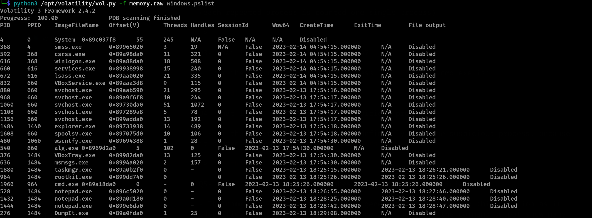
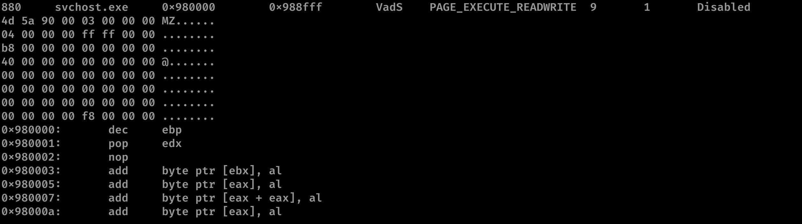
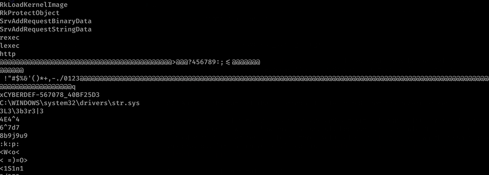
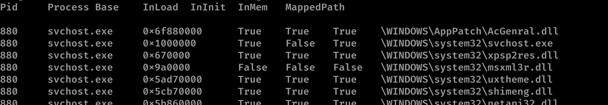

# BlackEnergy - endpoint_forensics


## Description

A multinational corporation has been hit by a cyber attack that has led to the theft of sensitive data. The attack was carried out using a variant of the BlackEnergy v2 malware that has never been seen before. The company's security team has acquired a memory dump of the infected machine, and they want you, as a soc analyst, to analyze the dump to understand the attack scope and impact.

-> challenge: https://download.cyberdefenders.org/BlueYard/c79-BE.zip

## Quick overview

Inorder to investigate the compromise that happened to the corporation using **BlackEnergy** malware, we're gonna analyse the memory dump using **Volatility3**


## Solution


Q1- Which volatility profile would be best for this machine?

- First, we're using Volatility3, so the profile doesn't matter a lot because volatility will identify the memory dump automatically without specifying profile, unlike Volatility2.
When we run the command `vol.py -f memory.raw windows.info`, we got this information 
```js
layer_name 0 WindowsIntel
memory_layer    1 FileLayer
KdDebuggerDataBlock   0x8054cde0
NTBuildLab 2600.xpsp.080413-2111
```
which shows that the system is **Windows XP SP**, after googling for some volatility2 profiles, I found the correct one.

-> `WINXPSP2x86`


Q2- How many processes were running when the image was acquired?

- The command `windows.pslist` will list all the running processes:


(each repeated process is counted one single process)

-> `19`

Q3- What is the process ID of cmd.exe?

- From the previous result, the process ID (`PID`) of cmd.exe is:

-> `1960`

Q4- What is the name of the most suspicious process?

- From the previous listing, we can definitely know the suspicious process, because its name is a type of malware `Rootkits`

-> `rootkit.exe`

Q5- Which process shows the highest likelihood of code injection?

- The command `windows.malfind` will generally help answering this question as it identifies any suspicious lines of code in processes, the command output show many processes, but the obvious one is `svchost.exe` because it's a famous target for malware authors because it's hard to notice the malicious behaviour from it (many instances of this process always run on every windows machine)



-> `svchost.exe`

Q6- There is an odd file referenced in the recent process. Provide the full path of that file.

- The memory dump of the malicious instance of svchost.exe contain a lot of file paths and stuff, it would be more efficient if we directly search in the injected part ( injected dll ) within the process, first we need to dump this part using `python3 vol.py -f memory.raw -o output/ windows.malfind --dump --pid 880`, we'll try to run the `strings` command agains it:
`



The file `C:\WINDOWS\system32\drivers\str.sys` looks suspicious because of its name and that it's among important windows files and drivers, it must be investigated.

-> `C:\WINDOWS\system32\drivers\str.sys`

Q7- What is the name of the injected dll file loaded from the recent process?

- I spent a lot of time on this questions and sometimes I went a lot far XD. Using the `dlllist` plug-in won't show anything useful, because it lists only DLLs that are linked within the process, I found more useful plug-in `ldrmodules` which doesn't have the previous limitation we mentioned, run: `python3 vol.py -f memory.raw windows.ldrmodules --pid 880`



As we see, the values of `InLoad` and `InInit` and `InMem` for `\WINDOWS\system32\msxml3r.dll` are False because there are discrepancies between `PEB` and `VAD` structures about this executable ( read more: http://akovid.blogspot.com/2014/04/difference-among-dlllistldrmodulesand.html ), which makes it suspicious.
And also its `Base address` is close to that one we'll discover in the final question.

-> `msxml3r.dll`

Q8- What is the base address of the injected dll?

- The plug-in `malfind` is really helpful and it shows the base address of the suspicious  injected executable within `svchost.exe` with PID 880.

-> `0x980000`
